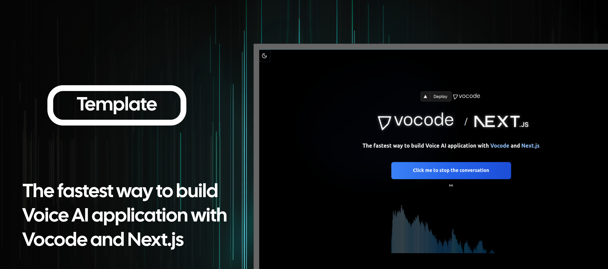

<a href="https://github.com/ArtisanLabs/vocode-next-vercel-template">
  
  <h1 align="center">Next.js/Vercel Template with Vocode's FastAPI Python Backend</h1>
</a>

<p align="center">
  The fastest way to build Voice AI application with 
  <a href="https://vocode.dev" target="_blank" rel="noopener noreferrer"> Vocode</a> and 
  <a href="https://nextjs.org" target="_blank" rel="noopener noreferrer"> Next.js</a>
</p>

<p align="center">
  <a href="#features"><strong>Features</strong></a> ·
  <a href="#demo"><strong>Demo</strong></a> ·
  <a href="https://vercel.com/new/clone?repository-url=https%3A%2F%2Fgithub.com%2FArtisanLabs%2Fvocode-next-vercel-template&env=OPENAI_API_KEY,DEEPGRAM_API_KEY,AZURE_SPEECH_KEY,AZURE_SPEECH_REGION"><strong>Deploy to Vercel</strong></a> ·
  <a href="#clone-and-run-locally"><strong>Clone and run locally</strong></a> ·
  <a href="#feedback-and-issues"><strong>Feedback and issues</strong></a>
  <a href="#more-vocode-examples"><strong>More Examples</strong></a>
</p>
<br/>

<p align="center">
  <a href="https://vercel.com/new/clone?repository-url=https%3A%2F%2Fgithub.com%2FArtisanLabs%2Fvocode-next-vercel-template&env=OPENAI_API_KEY,DEEPGRAM_API_KEY,AZURE_SPEECH_KEY,AZURE_SPEECH_REGION">
    
  </a>
</p>

First, clone the repository:

```bash
git clone https://github.com/ArtisanLabs/vocode-next-vercel-template
```

Then, install the dependencies:

```bash
npm install
# or
yarn install
```

To run the development server:

```bash
npm run dev
# or
yarn dev
```

Open [http://localhost:3000](http://localhost:3000) with your browser to see the result. The page auto-updates as you edit the file.

## Features

- Local Development: This template is configured to work seamlessly in a local environment, using Python as backend FastAPI.
- FastAPI Integration: The template establishes a connection between the Next.js frontend and the FastAPI Python backend.
- Vercel Deployment: While Vercel does not currently support WebSocket, this template can still be deployed on Vercel as a frontend application.

## Contributing

Contributions are welcome! Please read our [Contributing Guide](./CONTRIBUTING.md) and our [Code of Conduct](./CODE_OF_CONDUCT.md) for more information.

## License

This project is licensed under the [MIT License](./LICENSE).

## Contact

If you have any questions, feel free to open an issue or contact us directly at our [GitHub](https://github.com/vocodedev).
